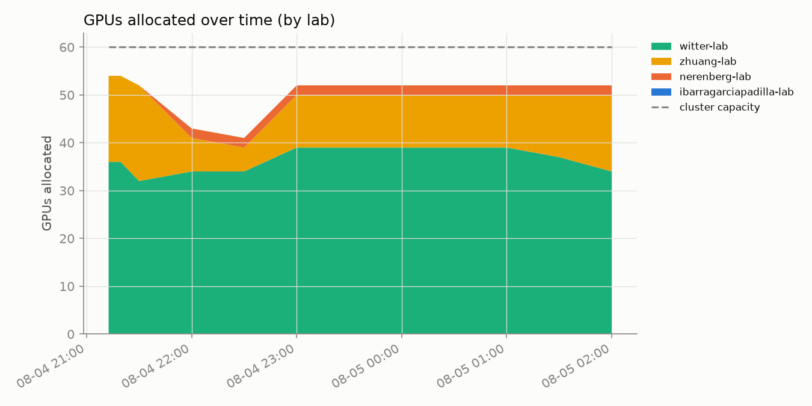
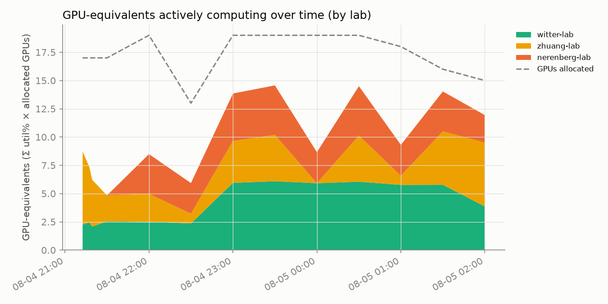

# hopper_monitor

Automated GPU/CPU/queue utilization tracker for `hopper.cluster`, updated every 30 minutes by cron. Usernames are anonymized to a stable per-account pseudonym; lab names are real.

Last updated: 2026-08-05T02:00:17-07:00
Samples: 13 queue snapshots, 13 GPU snapshots

## Resources

`hopper.cluster` currently reports **60 GPUs** and **2176 CPUs** total:

| Nodes | Count | CPUs/node | RAM/node | GPUs/node |
|---|---:|---:|---:|---|
| `gpu01`-`gpu15` | 15 | 128 | 750 GB | 4× NVIDIA L40S (48 GB VRAM) |
| `himem01`-`himem02` | 2 | 128 | 3000 GB | none |

## Headline

- **84.9%** of the cluster's 60 GPUs allocated, averaged across all samples
- **57.1%** average `nvidia-smi` utilization *when* a GPU is allocated to a job

## Per lab / per user

| Lab | User | GPU-hours allocated | CPU-hours allocated | GPU utilization |
|---|---|---:|---:|---:|
| witter-lab | user-d58f5a15 | 165.3 | 1322.3 | 8% |
| zhuang-lab | user-0db9ced0 | 63.2 | 63.2 | 58% |
| witter-lab | user-554c620c | 28.2 | 213.8 | 95% |
| nerenberg-lab | user-6bb5f332 | 9.0 | 45.0 | 75% |
| ibarragarciapadilla-lab | user-eec7ffae | 0.0 | 15.9 | — |
| ibarragarciapadilla-lab | user-3cfc41a3 | 0.0 | 634.8 | — |

## Usage over time

The third chart is GPU-hardware-utilization weighted by allocation (Σ util% across allocated GPUs), stacked by lab, with the dashed line showing how many GPUs were allocated at that moment. The gap between the stack and the dashed line is allocated-but-idle capacity.

## Queue

## Priority vs. usage

This cluster's Slurm priority is computed from fairshare + age + job size (`PriorityWeightTRES` is unset), so it does not weight GPU-heavy usage any differently from CPU-heavy usage. If these two panels look similarly shaped, that confirms it in practice.

## Allocated but idle (top 10)

Users holding a GPU allocation with `nvidia-smi` utilization ≤10% the longest, cumulatively:

| User | Lab | Idle GPU-hours |
|---|---|---:|
| user-d58f5a15 | witter-lab | 10.6 |
| user-0db9ced0 | zhuang-lab | 8.6 |
| user-6bb5f332 | nerenberg-lab | 3.0 |

