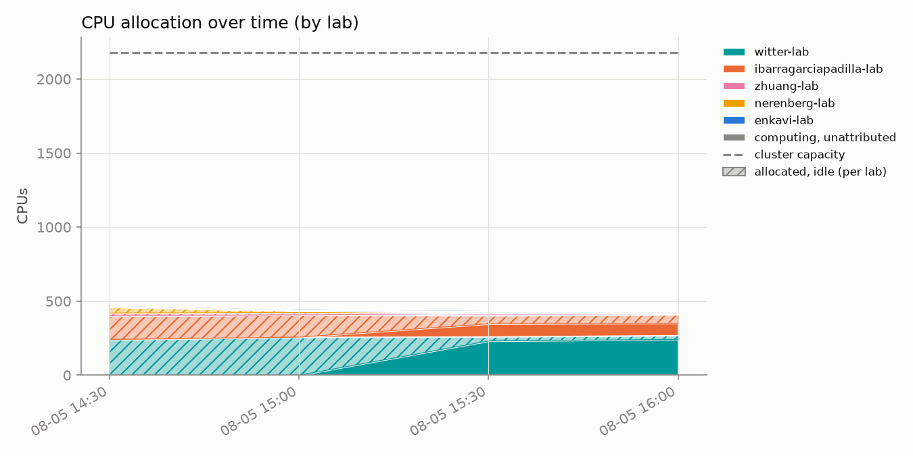
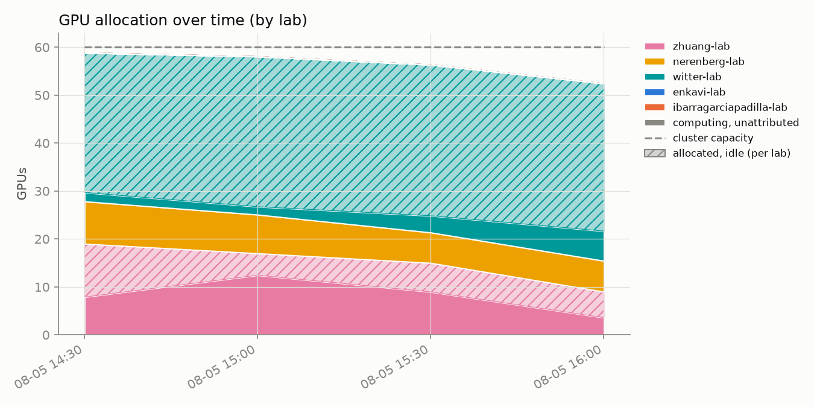
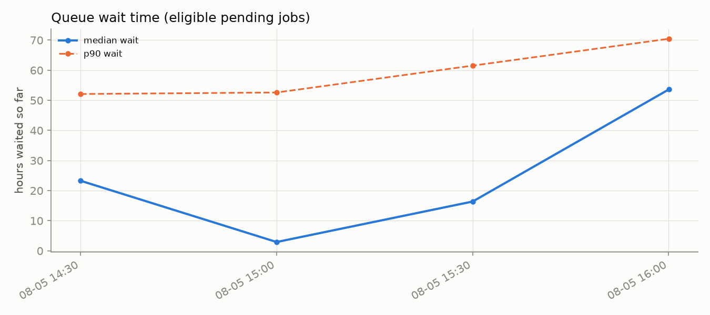
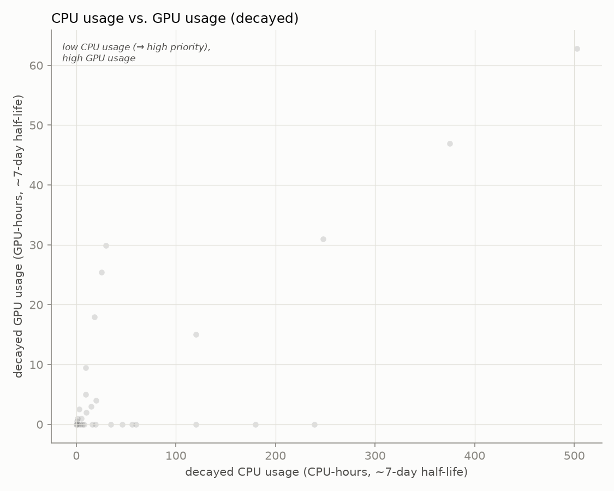

# hopper_monitor

Automated GPU/CPU/queue utilization tracker for `hopper.cluster`, updated every 30 minutes by cron. Usernames are anonymized to a stable per-account pseudonym; lab names are real.

Last updated: 2026-08-05T16:00:29-07:00
Samples: 4 queue snapshots, 4 GPU snapshots

## Resources

`hopper.cluster` currently reports **60 GPUs** and **2176 CPUs** total:

| Nodes | Count | CPUs/node | RAM/node | GPUs/node |
|---|---:|---:|---:|---|
| `gpu01`-`gpu15` | 15 | 128 | 750 GB | 4× NVIDIA L40S (48 GB VRAM) |
| `himem01`-`himem02` | 2 | 128 | 3000 GB | none |

## Headline

- **85.0%** of the cluster's 60 GPUs allocated, averaged across all samples
- **32.0%** average `nvidia-smi` utilization *when* a GPU is allocated to a job
- **90.6%** average cgroup CPU utilization *when* a CPU is allocated to a job

## Per lab / per user

<table>
<tr><th>Lab</th><th>User</th><th align='right'>GPU-hours allocated</th><th align='right'>CPU-hours allocated</th><th align='right'>GPU utilization</th></tr>
<tr style='background-color:#d8efef'><td>witter-lab</td><td>user-d58f5a15</td><td align='right'>63.0</td><td align='right'>504.0</td><td align='right'>3%</td></tr>
<tr style='background-color:#fbebf1'><td>zhuang-lab</td><td>user-0db9ced0</td><td align='right'>30.0</td><td align='right'>30.0</td><td align='right'>42%</td></tr>
<tr style='background-color:#d8efef'><td>witter-lab</td><td>user-554c620c</td><td align='right'>5.0</td><td align='right'>9.5</td><td align='right'>84%</td></tr>
<tr style='background-color:#fcf0d8'><td>nerenberg-lab</td><td>user-6bb5f332</td><td align='right'>4.0</td><td align='right'>20.0</td><td align='right'>63%</td></tr>
<tr style='background-color:#fcf0d8'><td>nerenberg-lab</td><td>user-b12dc074</td><td align='right'>0.0</td><td align='right'>16.0</td><td align='right'>—</td></tr>
<tr style='background-color:#fce8e0'><td>ibarragarciapadilla-lab</td><td>user-eec7ffae</td><td align='right'>0.0</td><td align='right'>56.0</td><td align='right'>—</td></tr>
<tr style='background-color:#fce8e0'><td>ibarragarciapadilla-lab</td><td>user-3cfc41a3</td><td align='right'>0.0</td><td align='right'>240.0</td><td align='right'>—</td></tr>
<tr style='background-color:#dfeaf8'><td>enkavi-lab</td><td>user-c21bdaa4</td><td align='right'>0.0</td><td align='right'>8.0</td><td align='right'>—</td></tr>
</table>

(Row background is each lab's chart color, lightened, matching the charts above - GitHub strips the inline CSS that carries it (confirmed against the live rendered page), so on github.com this table renders plain; the tint shows in renderers that keep inline styles, e.g. an editor's local Markdown preview.)

## Usage over time

Both charts now share the same structure: solid color is *utilized* by lab, translucent + hatched (same color) on top of it is that lab's *allocated but idle*, solid gray above that is real usage that couldn't be traced to a job or lab, and the dashed line is total cluster capacity - any gap above it is unallocated headroom. CPU utilization comes from cgroup v2 accounting (`cpu.stat`'s `usage_usec`, cumulative CPU time per job) read directly off each node, the delta between consecutive samples divided by wall-clock time - `sstat` returns nothing usable for this on this cluster, so this reads the kernel's own accounting file instead of going through Slurm's job-accounting plugin.

Attribution is cross-referenced two ways: `nvidia-smi`'s own process listing (misses containerized/namespaced processes - it just can't see those PIDs), backfilled from Slurm's own GPU-to-job binding record (`scontrol show job -dd`, which doesn't depend on process visibility at all - it's the scheduler's own allocation, not an inference from what a node will show over ssh). The scontrol fallback attributed **172** GPU readings this run that the process-listing path missed.

## Queue

Only jobs Slurm is actively scoring for scheduling (has a `sprio` priority) count as "pending" here - a job blocked on an unmet dependency or an array-task throttle isn't competing for resources yet, so its wait time reflects pipeline design, not cluster congestion, and would otherwise inflate this chart with something unrelated to scheduler load.

## CPU usage vs. GPU usage

Each point is one user at one snapshot (n=31), not averaged over time - the point is to see how a user's position moves, not collapse it to a single number. Both axes are usage decayed with Slurm's own ~7-day fairshare half-life (`PriorityDecayHalfLife` on this cluster), not a lifetime total or a per-day average, so this is close to what Slurm itself is actually tracking at each moment.

**CPU usage (x-axis) is essentially what earns priority here; GPU usage (y-axis) is what Slurm could weight the same way but doesn't**, confirmed directly from the Slurm config: `PriorityWeightTRES` is unset, and partition `main` has no `TRESBillingWeights` configured, so fairshare usage accounting bills by CPU count alone - a job holding 4 GPUs and 8 CPUs accrues the same usage debt as an 8-CPU, no-GPU job. The users worth a second look are in the **upper-left**: low decayed CPU usage (so a high, unpenalized fairshare priority) paired with high decayed GPU usage.

## Recommendations

1. **Make GPU usage count toward priority.** It structurally can't today - see the confirmation above. Fix by setting `TRESBillingWeights` on the `main` partition to give GPUs a nonzero weight (e.g. `scontrol update partition=main TRESBillingWeights=CPU=1.0,GRES/gpu=<weight>`) and/or giving `PriorityWeightTRES` a GPU component, then restarting `slurmctld`. The weight value is a policy call (how many CPUs one GPU should be "worth") - not something to pick from monitoring data alone.

2. **Act on sustained low utilization, not just report it.** The per lab/user table above already shows GPU utilization by user - the CPU vs. GPU usage chart above is a more direct way to spot it (upper-left quadrant). Two escalating steps on top of that: email a reminder once a user's utilization stays low for a sustained stretch, and if it doesn't improve after the reminder, taper their priority (QOS demotion or a fairshare penalty) rather than leaving it honor-system. Not implemented here - needs a policy decision first (threshold, grace period, who gets cc'd, and mail delivery from this host) before it's safe to automate.

