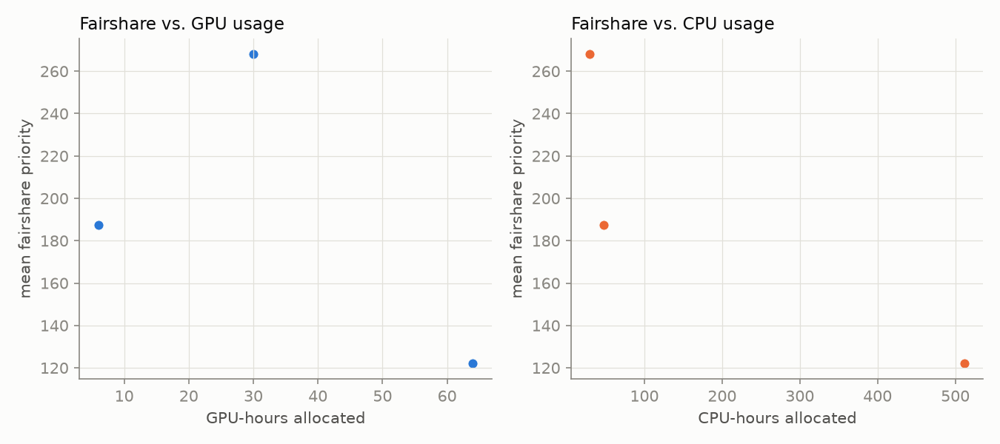

# hopper_monitor

Automated GPU/CPU/queue utilization tracker for `hopper.cluster`, updated every 30 minutes by cron. Usernames are anonymized to a stable per-account pseudonym; lab names are real.

Last updated: 2026-08-05T09:00:17-07:00
Samples: 4 queue snapshots, 4 GPU snapshots

## Resources

`hopper.cluster` currently reports **60 GPUs** and **2176 CPUs** total:

| Nodes | Count | CPUs/node | RAM/node | GPUs/node |
|---|---:|---:|---:|---|
| `gpu01`-`gpu15` | 15 | 128 | 750 GB | 4× NVIDIA L40S (48 GB VRAM) |
| `himem01`-`himem02` | 2 | 128 | 3000 GB | none |

## Headline

- **86.7%** of the cluster's 60 GPUs allocated, averaged across all samples
- **47.6%** average `nvidia-smi` utilization *when* a GPU is allocated to a job

## Per lab / per user

| Lab | User | GPU-hours allocated | CPU-hours allocated | GPU utilization |
|---|---|---:|---:|---:|
| witter-lab | user-d58f5a15 | 64.0 | 512.0 | 9% |
| zhuang-lab | user-0db9ced0 | 30.0 | 30.0 | 66% |
| witter-lab | user-554c620c | 6.0 | 48.0 | 68% |
| nerenberg-lab | user-6bb5f332 | 4.0 | 20.0 | 84% |
| ibarragarciapadilla-lab | user-eec7ffae | 0.0 | 6.0 | — |
| ibarragarciapadilla-lab | user-3cfc41a3 | 0.0 | 240.0 | — |

## Usage over time

The GPU chart layers four things: solid color is GPU-hardware utilization by lab (Σ util% across that lab's allocated GPUs); solid gray is real utilization `nvidia-smi` reports that couldn't be traced to a job or lab (the ssh-based PID lookup misses some processes - likely containerized ones outside its PID namespace); the hatched gray band on top of that is *actually* idle - allocated but not computing at all; and the dashed line is total cluster GPU capacity, so any gap above it is unallocated headroom.

## Queue

## Fairshare vs. usage

Each point is one user on one day (n=3): that day's allocated GPU/CPU-hours against their mean *fairshare* priority component that same day, for everyone who ran something that day. Not a lifetime total per user - that would only grow and would mix together usage from weeks ago with today's fairshare. This plots the fairshare component specifically, not total Slurm priority - total priority also carries an age term (`PriorityWeightAge`=1000 vs `PriorityWeightFairShare`=10000) that, over any short window, accounts for essentially all of the movement in total priority regardless of usage - plotting total priority against usage would mostly be plotting time-in-queue against usage.

**GPU usage does not currently affect priority, confirmed directly from the Slurm config**, not just inferred from the chart shape: `PriorityWeightTRES` is unset (a job's own GPU/CPU mix carries no weight), and partition `main` has no `TRESBillingWeights` configured, so fairshare usage accounting bills by CPU count alone - a job holding 4 GPUs and 8 CPUs accrues the same usage debt as an 8-CPU, no-GPU job. If the two panels above look similarly shaped, that's this setting in action, not a coincidence.

## Allocated but idle (top 10)

Users holding a GPU allocation with `nvidia-smi` utilization ≤10% the longest, cumulatively:

| User | Lab | Idle GPU-hours |
|---|---|---:|
| user-d58f5a15 | witter-lab | 9.0 |
| user-0db9ced0 | zhuang-lab | 3.5 |
| user-554c620c | witter-lab | 1.0 |
| user-6bb5f332 | nerenberg-lab | 0.5 |

## Recommendations

1. **Make GPU usage count toward priority.** It structurally can't today - see the confirmation above. Fix by setting `TRESBillingWeights` on the `main` partition to give GPUs a nonzero weight (e.g. `scontrol update partition=main TRESBillingWeights=CPU=1.0,GRES/gpu=<weight>`) and/or giving `PriorityWeightTRES` a GPU component, then restarting `slurmctld`. The weight value is a policy call (how many CPUs one GPU should be "worth") - not something to pick from monitoring data alone.

2. **Act on sustained low utilization, not just report it.** The idle leaderboard above already identifies who's holding GPUs allocated-but-idle the longest. Two escalating steps on top of it: email a reminder once a user crosses an idle-hours threshold, and if utilization stays low after the reminder, taper their priority (QOS demotion or a fairshare penalty) rather than leaving it honor-system. Not implemented here - needs a policy decision first (threshold, grace period, who gets cc'd, and mail delivery from this host) before it's safe to automate.

