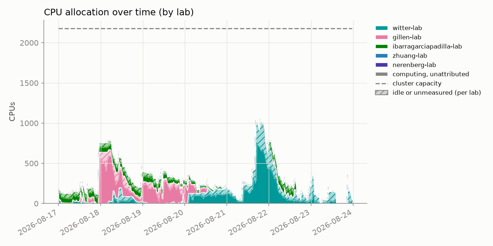
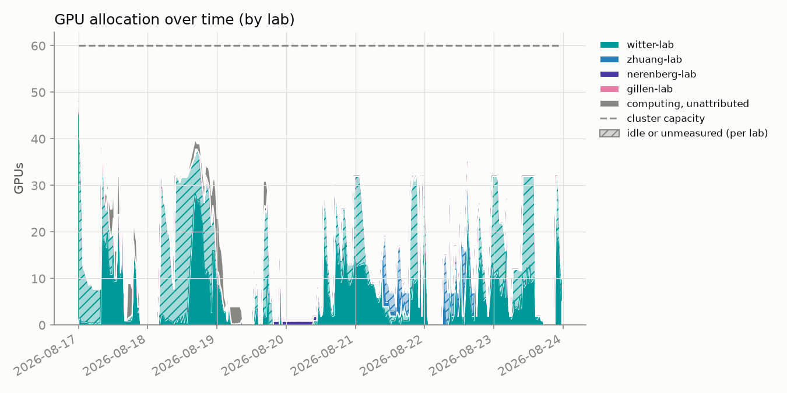
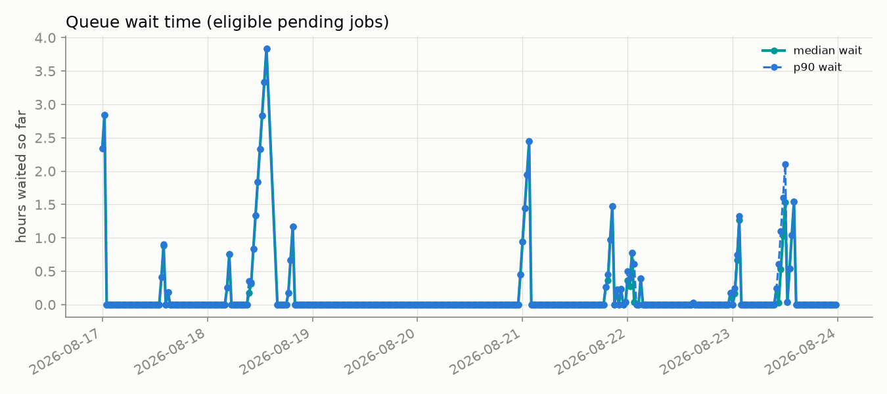
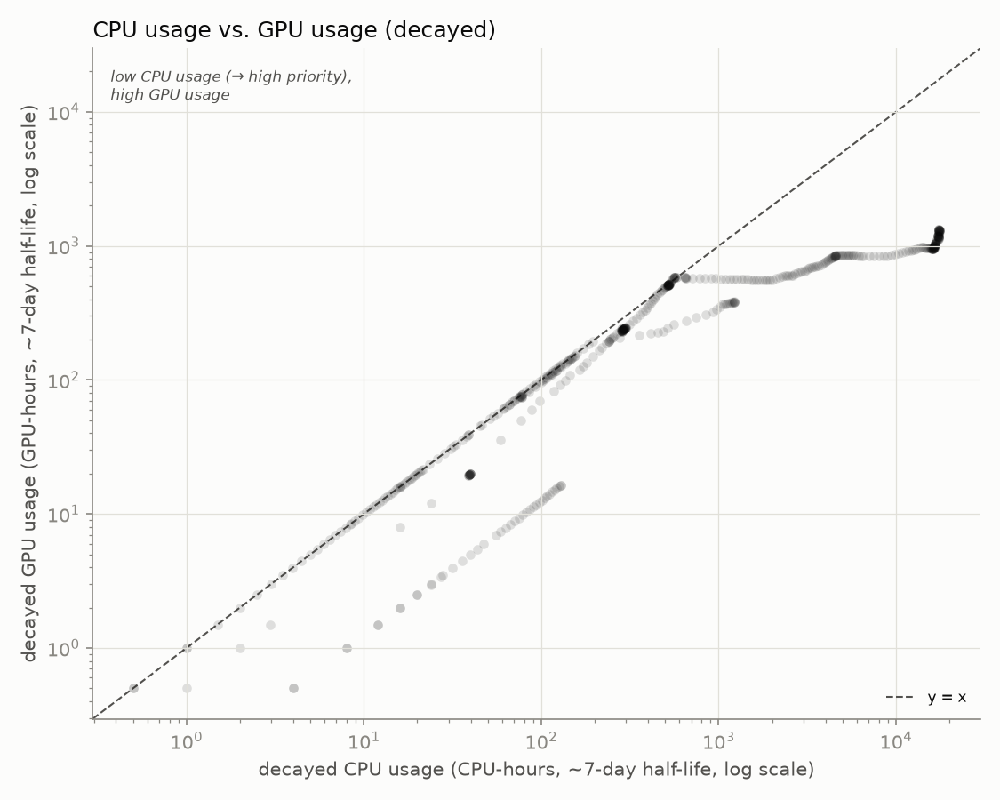

# hopper_monitor

Archived weekly snapshot: **2026-08-17 to 2026-08-23**. Usernames are anonymized to a stable per-account pseudonym; lab names are real.

[Back to the live dashboard](../../README.md)

Samples: 332 queue snapshots, 292 GPU snapshots

## Headline

- **24.2%** of the cluster's 60 GPUs allocated, averaged across all samples
- **37.4%** average observed `nvidia-smi` utilization *when* a GPU is allocated to a job
- **67.9%** average cgroup CPU utilization *when* a CPU is allocated to a job

## Per lab / per user

<table>
<tr><th>Lab</th><th>User</th><th align='right'>GPU-hours allocated</th><th align='right'>GPU utilization</th></tr>
<tr style='background-color:#d8efef'><td>witter-lab</td><td>user-554c620c</td><td align='right'>1784.4</td><td align='right'>46%</td></tr>
<tr style='background-color:#d8efef'><td>witter-lab</td><td>user-d58f5a15</td><td align='right'>415.5</td><td align='right'>7%</td></tr>
<tr style='background-color:#deebf4'><td>zhuang-lab</td><td>user-0db9ced0</td><td align='right'>162.5</td><td align='right'>25%</td></tr>
<tr style='background-color:#e3e1f1'><td>nerenberg-lab</td><td>user-fedb5feb</td><td align='right'>22.5</td><td align='right'>44%</td></tr>
<tr style='background-color:#d8efef'><td>witter-lab</td><td>user-f5bf0d80</td><td align='right'>17.5</td><td align='right'>41%</td></tr>
<tr style='background-color:#fbebf1'><td>gillen-lab</td><td>user-d21e03f5</td><td align='right'>3.5</td><td align='right'>82%</td></tr>
<tr style='background-color:#deebf4'><td>zhuang-lab</td><td>user-7d156b54</td><td align='right'>1.5</td><td align='right'>45%</td></tr>
<tr style='background-color:#fbebf1'><td>gillen-lab</td><td>user-b89a87ef</td><td align='right'>0.0</td><td align='right'>—</td></tr>
<tr style='background-color:#d8ecd8'><td>ibarragarciapadilla-lab</td><td>user-3cfc41a3</td><td align='right'>0.0</td><td align='right'>—</td></tr>
</table>

## Usage over time

Charts below cover this week: **2026-08-17 00:00 to 2026-08-24 00:00** (UTC-07:00).

Each named lab has its own color. Solid = utilized by lab, hatched = allocated but idle or unmeasured, gray = usage not traceable to a lab, dashed line = cluster capacity. Zero-usage legend entries are omitted.

Attribution combines `nvidia-smi`'s process listing with Slurm's GPU-to-job binding record; the latter caught **2650** readings the former missed.
Allocation counts include all nodes of each job, including corrected historical totals. Before October 2, 2026, utilization sampling could skip nodes in compressed hostlists; those missing readings cannot be reconstructed and do not establish that the GPUs were idle.
GPU-hour estimates credit at most one 30-minute interval per sample; collector outages are not extrapolated. CPU utilization is weighted by the allocated cores of jobs with observed counters.

## Queue

"Pending" here means Slurm is actively scoring the job (has a `sprio` priority) - excludes jobs blocked on a dependency or array-task throttle.

## CPU usage vs. GPU usage

One point per user per snapshot (n=515), usage decayed on Slurm's ~7-day fairshare half-life.

**GPU usage doesn't count toward priority on this cluster** (`TRESBillingWeights`/`PriorityWeightTRES` unset) - watch the **upper-left**: low CPU usage (high priority) with high GPU usage.

