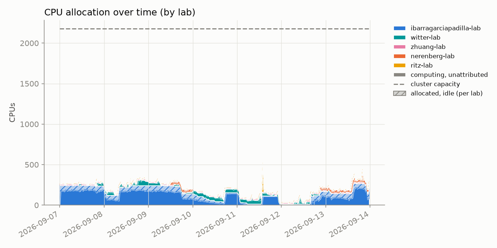
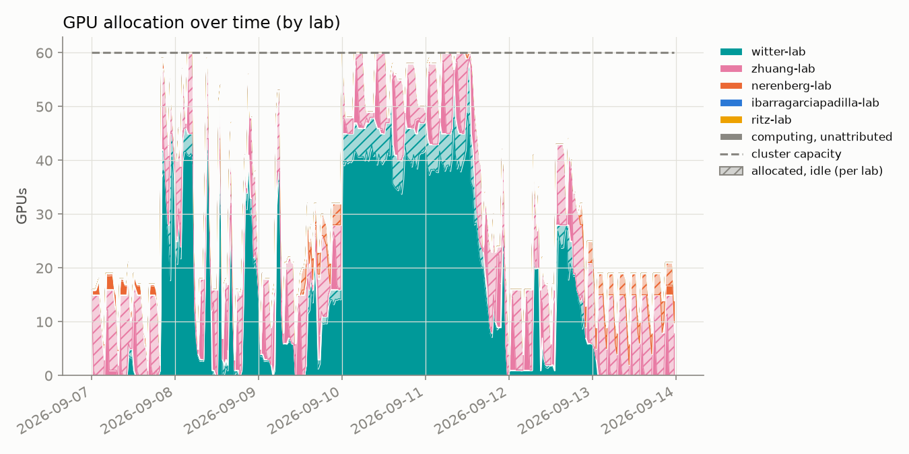
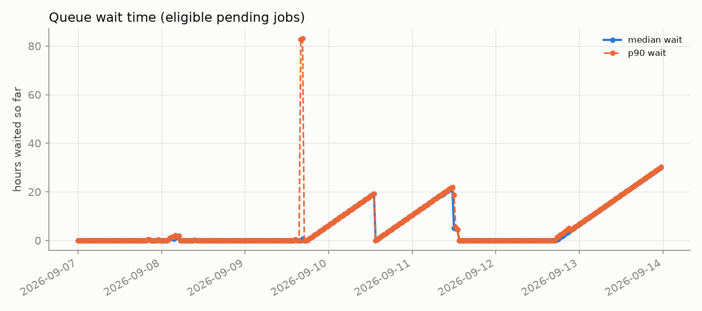
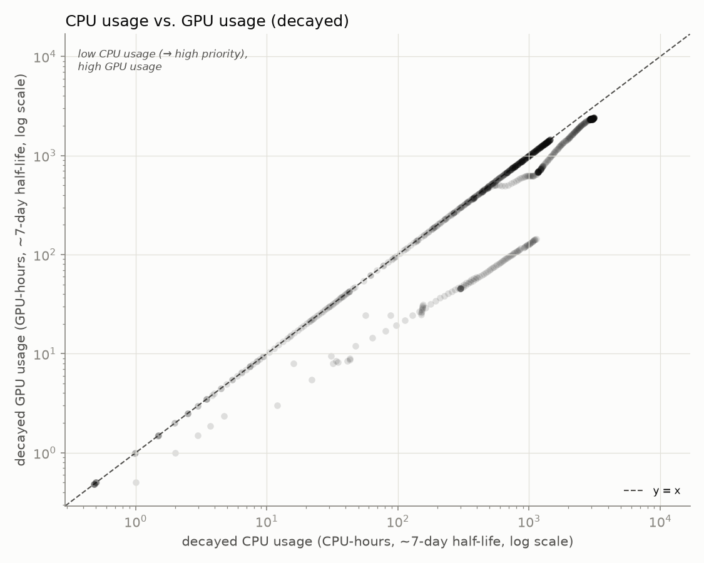

# hopper_monitor

Archived weekly snapshot: **2026-09-07 to 2026-09-13**. Usernames are anonymized to a stable per-account pseudonym; lab names are real.

[Back to the live dashboard](../../README.md)

Samples: 336 queue snapshots, 336 GPU snapshots

## Headline

- **52.9%** of the cluster's 60 GPUs allocated, averaged across all samples
- **58.8%** average `nvidia-smi` utilization *when* a GPU is allocated to a job
- **96.0%** average cgroup CPU utilization *when* a CPU is allocated to a job

## Per lab / per user

<table>
<tr><th>Lab</th><th>User</th><th align='right'>GPU-hours allocated</th><th align='right'>GPU utilization</th></tr>
<tr style='background-color:#d8efef'><td>witter-lab</td><td>user-554c620c</td><td align='right'>3091.0</td><td align='right'>82%</td></tr>
<tr style='background-color:#fbebf1'><td>zhuang-lab</td><td>user-0db9ced0</td><td align='right'>1996.0</td><td align='right'>24%</td></tr>
<tr style='background-color:#fce8e0'><td>nerenberg-lab</td><td>user-7eb22d7c</td><td align='right'>173.5</td><td align='right'>71%</td></tr>
<tr style='background-color:#fce8e0'><td>nerenberg-lab</td><td>user-fedb5feb</td><td align='right'>52.5</td><td align='right'>55%</td></tr>
<tr style='background-color:#d8efef'><td>witter-lab</td><td>user-f5bf0d80</td><td align='right'>10.5</td><td align='right'>47%</td></tr>
<tr style='background-color:#fbebf1'><td>zhuang-lab</td><td>user-ac8c851f</td><td align='right'>4.0</td><td align='right'>100%</td></tr>
<tr style='background-color:#fbebf1'><td>zhuang-lab</td><td>user-7d156b54</td><td align='right'>2.5</td><td align='right'>35%</td></tr>
<tr style='background-color:#fce8e0'><td>nerenberg-lab</td><td>user-b12dc074</td><td align='right'>1.5</td><td align='right'>59%</td></tr>
<tr style='background-color:#fcf0d8'><td>ritz-lab</td><td>user-4a771e4a</td><td align='right'>0.0</td><td align='right'>—</td></tr>
<tr style='background-color:#dfeaf8'><td>ibarragarciapadilla-lab</td><td>user-3cfc41a3</td><td align='right'>0.0</td><td align='right'>—</td></tr>
<tr style='background-color:#dfeaf8'><td>ibarragarciapadilla-lab</td><td>user-40b4d372</td><td align='right'>0.0</td><td align='right'>—</td></tr>
<tr style='background-color:#dfeaf8'><td>ibarragarciapadilla-lab</td><td>user-eec7ffae</td><td align='right'>0.0</td><td align='right'>—</td></tr>
</table>

## Usage over time

Charts below cover this week: **2026-09-07 00:00 to 2026-09-14 00:00** (UTC-07:00).

Solid = utilized by lab, hatched = allocated but idle, gray = usage not traceable to a lab, dashed line = cluster capacity.

Attribution combines `nvidia-smi`'s process listing with Slurm's GPU-to-job binding record; the latter caught **1007** readings the former missed.

## Queue

"Pending" here means Slurm is actively scoring the job (has a `sprio` priority) - excludes jobs blocked on a dependency or array-task throttle.

## CPU usage vs. GPU usage

One point per user per snapshot (n=1480), usage decayed on Slurm's ~7-day fairshare half-life.

**GPU usage doesn't count toward priority on this cluster** (`TRESBillingWeights`/`PriorityWeightTRES` unset) - watch the **upper-left**: low CPU usage (high priority) with high GPU usage.

